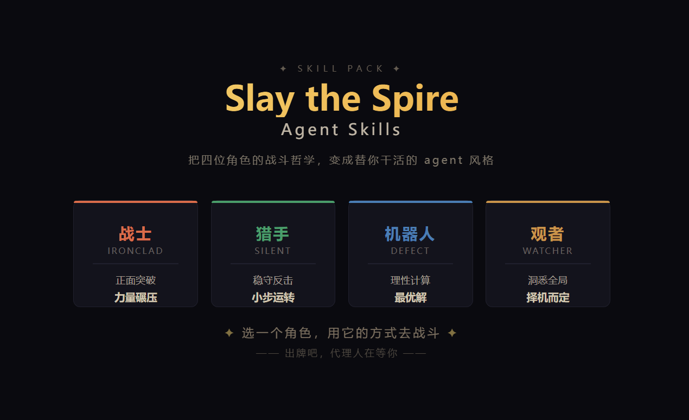

# Slay the Spire — Agent Skills

> 把杀戮尖塔四位角色的战斗哲学,变成替你干活的 agent 风格。

<p align="center">
  
</p>

## 这是什么

四个 agent skill,每个对应杀戮尖塔的一位角色。用户通过指令选择一个角色,agent 就以该角色的风格来执行任务——从思考方式到输出语气,完全贴合角色特质。

## 安装

将本仓库克隆或复制到你的 agent 工作目录:

```bash
git clone https://github.com/yanjiachu/SlayTheSpire-skill.git
```

如果你的 agent 平台支持 skill 目录注册,将 `.skill.md` 文件放入对应目录即可。

## 使用

### 选择角色

| 指令 | 角色 | 风格 |
|------|------|------|
| `/skill sts-ironclad` | 战士 Ironclad | 正面突破,力量碾压 |
| `/skill sts-silent` | 猎手 Silent | 精密策划,一击毙命 |
| `/skill sts-defect` | 机器人 Defect | 理性计算,最优解 |
| `/skill sts-watcher` | 观者 Watcher | 洞悉全局,择机而定 |

### 示例

```
/skill sts-ironclad   帮我重构这个模块,我要最快的方案
/skill sts-silent     分析这段代码的所有执行路径和风险点
/skill sts-defect     为这个系统设计一个可扩展的架构
/skill sts-watcher    评估这个项目的技术选型是否合理
```

## 仓库结构

```
SlayTheSpire-skill/
├── .gitignore
├── LICENSE
├── README.md
│
├── sts-ironclad.skill.md        # 战士 skill 定义
├── sts-silent.skill.md          # 猎手 skill 定义
├── sts-defect.skill.md          # 机器人 skill 定义
├── sts-watcher.skill.md         # 观者 skill 定义
│
└── references/
    ├── ironclad/
    │   ├── profile.md           # 角色背景设定
    │   └── style-guide.md       # 战斗风格到做事风格映射
    ├── silent/
    ├── defect/
    └── watcher/
```

## 自定义

你可以编辑 `references/<角色>/` 下的文件来调整角色设定,或直接修改 `.skill.md` 文件中的 prompt 来微调行为。

## 许可

MIT
